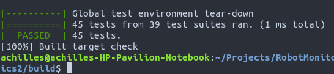

# Contributing to RMGraphics

:+1::tada: First off, thanks for taking the time to contribute! :tada::+1:

The following is a set of guidelines for contributing to **RMGraphics**. These are mostly guidelines, not rules. Use your best judgment, and feel free to propose changes to this repository in a pull request.

### Design Decisions

When we make a significant decision in how we maintain the project and what we can or cannot support, we will document it in the repository's documentation page. If you have a question around how we do things, check to see if it is documented there. If it is *not* documented there, you can ask us at our social media page.

## How Can I Contribute?

### Reporting Bugs

This section guides you through submitting a bug report for **RMGraphics** projects. Following these guidelines helps maintainers and the community understand your report :pencil:, reproduce the behavior :computer: :computer:, and find related reports :mag_right:.

When you are creating a bug report, please include as many details as possible.

> **Note:** If you find a **Closed** issue that seems like it is the same thing that you're experiencing, open a new issue and include a link to the original issue in the body of your new one.

#### How Do I Submit A (Good) Bug Report?

Bugs are tracked as [GitHub issues](https://guides.github.com/features/issues/). Create an issue on that repository and provide the following information:

Explain the problem and include additional details to help maintainers reproduce the problem:

* **Use a clear and descriptive title** for the issue to identify the problem.
* **Describe the exact steps which reproduce the problem** in as many details as possible. In case of a library, please show the full code you wrote if possible.
* **Describe the behavior you observed** and point out what exactly is the problem with that behavior.
* **Explain which behavior you expected to see instead and why.**

Include details about your configuration and environment:

* **On which platform you're using?**

### Suggesting Enhancements

This section guides you through submitting an enhancement suggestion for the project, including completely new features and minor improvements to existing functionality.

#### How Do I Submit A (Good) Enhancement Suggestion?

Enhancement suggestions are tracked as [GitHub issues](https://guides.github.com/features/issues/). Create an issue on that repository and provide the following information:

* **Use a clear and descriptive title** for the issue to identify the suggestion.
* **Describe the current behavior** and **explain which behavior you expected to see instead** and why.
* **Explain why this enhancement would be useful**.
* **List some other packages that the feature is reference from or inspired by.**
* **Specify the platform you're using.**

### Pull Requests

In a pull request, you write the code in the repository. The process described here has several goals:

- Maintain the project's quality
- Fix problems that are important to users
- Engage the community in working toward the best possible product
- Enable a sustainable system for the project's maintainers to review contributions

Please follow these steps to have your contribution considered by the maintainers:

1. Follow the style guides
2. Make sure your new code does not bring errors to the old code by running automated tests.
3. Don't forget to add label on pull request

While the prerequisites above must be satisfied prior to having your pull request reviewed, the reviewer(s) may ask you to complete additional design work, tests, or other changes before your pull request can be ultimately accepted.

#### Testing

The development of this project is a Test Driven Development (TDD). Whenever we add new feature or modify the functions, we run the test scripts on our own platform to make sure the system does not break because of the newly written code.

For testing, we use **Google Test** framework. This framework is embedded in the repository as a submodule. We also use **TravisCI** to see test results on multiple platforms with different build systems other than an individual's platform.

Assume you have setup the dependencies and written new code, you run this command from cmake build directory.

```bash
make check
```

Then, the automated tests run and show results like this.



When you pass the test, you are free to make the pull request.

## Style Guides

### Git Commit Messages

* Use the present tense ("Add feature" not "Added feature")
* Use the imperative mood ("Move cursor to..." not "Moves cursor to...")
* Limit the first line to 80 characters or less
* Reference issues and pull requests liberally after the first line
* Consider starting the commit message with an applicable emoji:
    * :bulb: `:bulb:` when adding new features/API
    * :construction: `:construction:` when writing implementation code
    * :art: `:art:` when improving the format/structure of the code
    * :racehorse: `:racehorse:` when improving performance
    * :do_not_litter: `:do_not_litter:` when plugging memory leaks
    * :memo: `:memo:` when writing docs
    * :checkered_flag: `:checkered_flag:` when fixing for Windows
    * :penguin: `:penguin:` when fixing for Linux
    * :apple: `:apple:` when fixing for Apple
    * :bug: `:bug:` when fixing a bug
    * :fire: `:fire:` when removing code or files
    * :poop: `:poop:` when adding bad code 
    * :white_check_mark: `:white_check_mark:` when adding tests
    * :green_heart: `:green_heart:` when adding or changing build scripts
    * :lock: `:lock:` when dealing with security
    * :arrow_up: `:arrow_up:` when adding or upgrading dependencies
    * :arrow_down: `:arrow_down:` when removing or downgrading dependencies

### Coding Style Guide

- For indentation, use 4 space characters instead of a single indent character.

- Let the maximum characters for each line of code 80.

- For curly bracket blocks,
  ```C
  void func(int i) {
      printf("I love Robotics");
      if(i < 0)
          func2(i);
      else if(i < 10) {
          int s = 2*i + 5;
          func3(s);
      }
  }
  ```

- For functions with long parameters,
  ```c++
  void draw3DLine(Context* ctx, float t, const Color &col,
                  const Vec3 &p1, const Vec3 &p2)
  {
      std::cout << "Draw line" << std::endl;
  }
  ```