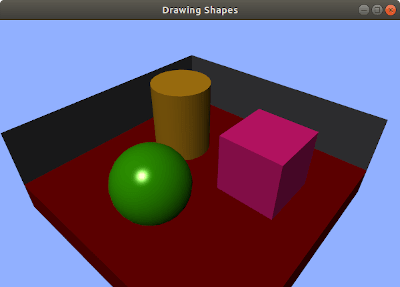

Simple and quick 2D/3D graphics rendering engine with the aim for making robotic simulations. Loads 2D/3D model files and texture files and easily control the pose and appearance of those 2D/3D objects. Lighting and shadow mapping are done in back-end processes. Performance is smooth since rendering engine uses shader programs and GPU power. The project uses **OpenGL** API and other external open source packages like **GLFW** and **wxWidgets** and is made a cross-platform API.

## Documentation

You can see detailed project documentation including API specifications [here](https://khantkyawkhaung.github.io/robot-monitor-graphics).

## Contributing

If you are willing to help us enhancing this open source project, you can summit bug reports and feature suggestions as GitHub issues. You may also take part of the project making pull requests as well. Your contributions to our project is warmly welcomed.

## License

This project is licensed under the **MIT** License - see the [LICENSE](https://github.com/khantkyawkhaung/robot-monitor-graphics/blob/master/LICENSE) file for details.